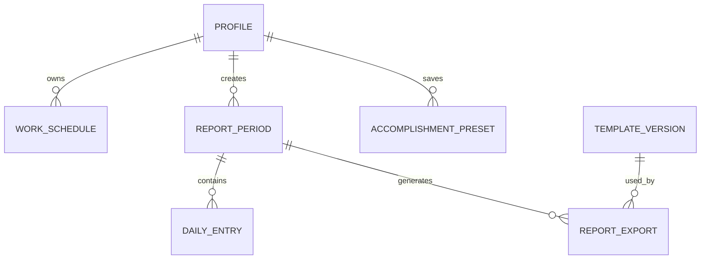

# Auri — Cursor Master Build Specification

> Product: Auri  
> Tagline: **Work, without the paperwork.**  
> Document purpose: the single source of truth Cursor must use to design, build, test, and deploy the Auri web application.  
> Initial deployment: Vercel + Supabase  
> Primary timezone: `Asia/Manila`  
> Status: implementation-ready v1 specification

---

## 0. Instructions for Cursor

Read this entire document before generating code. Do not start by creating random pages or a generic dashboard.

When implementing Auri:

1. Treat this file as the product, design, architecture, and acceptance-test contract.
2. Work one phase at a time, in the order listed in the implementation roadmap.
3. Before each phase, inspect the existing repository and preserve completed work.
4. Do not rebuild the official report files from scratch. Auri must fill versioned copies of the supplied DOCX and XLSX templates while preserving their layout.
5. Keep source templates untouched. Generate separate runtime templates.
6. Use strict TypeScript. Do not add `any` merely to silence errors.
7. Keep business logic out of React components. Time calculations, report mapping, file generation, validation, and database access belong in dedicated modules.
8. Use Server Components by default. Add Client Components only where browser state or animation is required.
9. Do not expose a Supabase service-role key to the browser.
10. Enable Row Level Security on every user-owned table and private Storage bucket.
11. Run formatting, linting, type checking, unit tests, and relevant end-to-end tests at the end of every phase.
12. Never mark a phase complete when its acceptance criteria are failing.
13. Keep a concise implementation log in `docs/IMPLEMENTATION_STATUS.md` with completed items, current blockers, and next work.
14. If the repository and this file disagree, pause and document the conflict before making a destructive rewrite.
15. Prefer the simplest maintainable implementation that satisfies this specification. Do not introduce microservices, queues, or an ORM unless a measured need appears.

### Cursor bootstrap prompt

Use the following as the first prompt after placing this file and the two templates in the repository:

```text
Read AURI_CURSOR_MASTER_SPEC.md completely. Then inspect the repository and the supplied DOCX/XLSX templates. Do not implement features yet.

Create:
1. docs/IMPLEMENTATION_STATUS.md
2. docs/TEMPLATE_AUDIT.md
3. a phase-by-phase implementation plan mapped directly to the master specification

In TEMPLATE_AUDIT.md, verify the real worksheet names, DOCX table structure, target cells, formulas, merged ranges, print settings, page sizes, duplicated sections, and template hashes. Identify any discrepancy between the files and this specification.

After the audit, implement only Phase 0 and Phase 1. Run all required checks, summarize the changed files, list any assumptions, and stop for review before Phase 2.
```

---

## 1. Product summary

Auri is a focused web application that turns one set of daily attendance and accomplishment entries into two official outputs:

- a Daily Time Record based on **CSC Form No. 48** in XLSX format; and
- an Accomplishment Report in DOCX format.

The user should enter daily information once, review it in a friendly interface, and generate both files without manually editing Office templates every pay period.

Auri is initially a personal tool for Rodge Andru P. Viloria, but the data model and security boundaries must safely support multiple independent accounts later. It is not an HR attendance platform, payroll system, biometric time clock, or approval workflow in v1.

### Product promise

> Record the work once. Let Auri handle the paperwork.

### Core value

- Reduce repetitive encoding across two documents.
- Preserve the familiar government forms instead of replacing them with a new design.
- Prevent inconsistent names, dates, hours, totals, and accomplishments.
- Make half-month reporting fast enough to finish in minutes.
- Keep the experience calm, modern, and pleasant without making official output files look unofficial.

### Target user

The initial user is a contract-of-service employee who:

- prepares a DTR and an accomplishment report for each reporting period;
- commonly works a configurable compressed schedule;
- repeats several accomplishment descriptions across days;
- needs editable DOCX and XLSX outputs for review and printing; and
- primarily uses a desktop or laptop but may enter information from a phone.

### Primary success metric

A complete half-month period with both valid output files can be prepared in under five minutes after the daily entries exist.

### Supporting success metrics

- No duplicate daily encoding between DTR and accomplishment report.
- No unresolved template tokens in exported files.
- Both files open without a repair warning in current Microsoft Word and Excel.
- DTR left and right copies always contain identical values.
- Generated periods and files remain isolated per user.
- A draft is auto-saved and recoverable after refresh or connection loss.

---

## 2. Fixed product decisions

These choices are approved defaults for v1 unless the user explicitly changes them.

| Area                         | Decision                                                     |
| ---------------------------- | ------------------------------------------------------------ |
| Product name                 | Auri                                                         |
| Tagline                      | Work, without the paperwork.                                 |
| Brand color                  | Orange                                                       |
| Framework                    | Next.js App Router with TypeScript                           |
| Styling                      | Tailwind CSS with accessible headless primitives             |
| Animation                    | GSAP, used selectively                                       |
| Database                     | Supabase Postgres                                            |
| Authentication               | Supabase Auth                                                |
| File storage                 | Private Supabase Storage buckets                             |
| Hosting                      | Vercel                                                       |
| Source control               | GitHub                                                       |
| Package manager              | pnpm                                                         |
| Main locale                  | English                                                      |
| Date/time locale             | Philippine conventions, timezone `Asia/Manila`               |
| Initial account model        | Personal-use experience with secure multi-user isolation     |
| Primary periods              | First half: day 1–15; second half: day 16–last day           |
| Official outputs             | DOCX accomplishment report and XLSX DTR                      |
| PDF generation               | Deferred; use original Office files for exact printing in v1 |
| Signatures                   | Typed signatory names only in v1; no signature-image upload  |
| Admin panel                  | Not included in v1                                           |
| Generic template designer    | Not included in v1                                           |
| AI-generated accomplishments | Not included in v1                                           |

### Explicit non-goals for v1

- biometric attendance capture;
- location tracking;
- payroll computation;
- leave-credit accounting;
- supervisor approval routing;
- organization-wide employee management;
- arbitrary user-uploaded DOCX/XLSX mapping;
- in-browser editing of Word or Excel files;
- server-side LibreOffice conversion on Vercel;
- sending reports by email; and
- automatic claims that a generated report is legally signed or submitted.

---

## 3. Audit of the supplied templates

The source files are:

```text
ACCOMPLISHMENT - RODGE.docx
DTR RODGE.xlsx
```

The implementation must calculate and record a SHA-256 hash for each source and runtime template. Never silently overwrite a source template.

### 3.1 Accomplishment DOCX findings

The supplied DOCX is a landscape legal-size document with narrow margins. It contains:

- heading: `MUNICIPALITY OF SANCHEZ MIRA`;
- office: `VICE MAYOR’S OFFICE`;
- department placeholder;
- title: `ACCOMPLISHMENT REPORT`;
- employee name and period-covered fields;
- a daily table with date, AM, PM, time spent, daily accomplishment, and remarks;
- a certification statement;
- total hours; and
- four signature/signatory columns.

The sample period is August 1–15, 2026. The source contains **two copies of the complete report**. The second copy does not fit cleanly: its signature block flows to a third page. The first copy displays `80HRS`; the second displays `70`, so the duplicate content is also internally inconsistent.

#### Required DOCX decision

Keep the original source file unchanged. Create a derived runtime template named:

```text
accomplishment-report-v1.docx
```

The runtime template must:

- contain one complete report only;
- fit on one legal landscape page;
- provide up to 16 daily rows so day 16–31 periods fit;
- preserve the original visual language, borders, typography, alignment, certification, and signatory layout;
- replace sample values with template tags;
- contain no sample employee data; and
- pass a render comparison before being activated.

#### Runtime DOCX token contract

Use simple, flat Docxtemplater tags. Do not put logic or calculations inside the Office template.

```text
{municipality_name}
{office_name}
{department_name}
{report_title}
{employee_name}
{period_label}
{total_hours_label}
{certification_text}
{signatory_employee_name}
{signatory_employee_title}
{signatory_1_name}
{signatory_1_title}
{signatory_2_name}
{signatory_2_title}
{signatory_3_name}
{signatory_3_title}
```

Each of the 16 rows must contain:

```text
{r01_date} ... {r16_date}
{r01_am} ... {r16_am}
{r01_pm} ... {r16_pm}
{r01_time_spent} ... {r16_time_spent}
{r01_accomplishment} ... {r16_accomplishment}
{r01_remarks} ... {r16_remarks}
```

Unused rows must receive empty strings, not `null`, `undefined`, or visible placeholder text.

### 3.2 DTR XLSX findings

The workbook contains three visible sheets:

- `Sheet1`: the actual DTR;
- `Sheet2`: blank; and
- `Sheet3`: blank.

`Sheet1` spans approximately `A1:P60` and prints as one legal landscape page. It intentionally places two copies of CSC Form No. 48 side by side:

- left copy: columns `A:G`;
- spacer: column `H`;
- right copy: columns `I:O`.

Important template characteristics:

- page paper size code `14` (legal);
- landscape orientation;
- scale approximately `73%`;
- 0.25-inch outer margins;
- horizontally centered print output;
- merged title, name, period, header, total, and signature ranges;
- an existing drawing/VML package part that must not be dropped;
- day rows 1–31 at worksheet rows 14–44; and
- total undertime formulas in `F45` and `N45`.

#### DTR mapping contract

| Meaning                 | Left copy     | Right copy                                |
| ----------------------- | ------------- | ----------------------------------------- |
| Employee name           | `A6`          | `I6` or existing formula pointing to `A6` |
| Period label            | `D8`          | `L8` or existing formula pointing to `D8` |
| Day number              | `A14:A44`     | `I14:I44`                                 |
| AM arrival              | `B14:B44`     | `J14:J44`                                 |
| AM departure            | `C14:C44`     | `K14:K44`                                 |
| PM arrival              | `D14:D44`     | `L14:L44`                                 |
| PM departure            | `E14:E44`     | `M14:M44`                                 |
| Undertime hours         | `F14:F44`     | `N14:N44`                                 |
| Undertime minutes       | `G14:G44`     | `O14:O44`                                 |
| Total undertime hours   | `F45` formula | `N45` formula                             |
| Employee signature name | `A53`         | `I53`                                     |

The right-side values must always equal the left-side values. Populate both sets of day-entry cells directly unless the verified runtime template intentionally contains mirror formulas.

#### Required XLSX strategy

Do not recreate the workbook with a spreadsheet library. Make a byte-level copy of the original XLSX ZIP package, then patch only the necessary cell values in `Sheet1`. Preserve every unrelated ZIP part, style ID, merge, print setting, formula, relationship, drawing, and VML file.

Recommended production implementation:

- `jszip` to load and write the XLSX package;
- `@xmldom/xmldom` or an equivalent DOM-safe XML parser;
- cell-level helpers that preserve the existing `s` style attribute;
- `inlineStr` cells for display text; and
- numeric cells for undertime values where appropriate.

After generation, confirm that:

- `F45` and `N45` still contain formulas;
- `xl/drawings/drawing1.xml` still exists;
- `xl/drawings/vmlDrawing1.vml` still exists;
- all merge ranges remain;
- both copies match; and
- the workbook opens without repair prompts.

### 3.3 Template source-of-truth rules

```text
templates/
├── README.md
├── source/
│   ├── ACCOMPLISHMENT - RODGE.docx
│   └── DTR RODGE.xlsx
├── runtime/
│   ├── accomplishment-report-v1.docx
│   └── dtr-csc-form-48-v1.xlsx
└── manifests/
    ├── accomplishment-report-v1.json
    └── dtr-csc-form-48-v1.json
```

Each manifest must include:

```json
{
  "id": "accomplishment-report-v1",
  "type": "docx",
  "version": 1,
  "sourceFile": "ACCOMPLISHMENT - RODGE.docx",
  "runtimeFile": "accomplishment-report-v1.docx",
  "sourceSha256": "computed-during-preparation",
  "runtimeSha256": "computed-during-preparation",
  "pageSize": "legal",
  "orientation": "landscape",
  "active": true
}
```

Runtime templates are uploaded to a private Storage bucket during setup. Export records must store the template version and hash used to create each file.

---

## 4. User experience

### 4.1 Main journey

1. The user signs in.
2. First-time onboarding collects employee, office, signatory, and schedule information.
3. The dashboard offers `Create first-half report` or `Create second-half report` for the current month.
4. Auri creates every date in the period and classifies workdays and scheduled days off.
5. The user enters AM/PM times and accomplishments, using reusable presets when helpful.
6. Auri auto-calculates worked time and proposed undertime.
7. The user reviews validation warnings and the report preview.
8. The user generates DOCX and XLSX files together.
9. Auri stores the generated versions in history and offers individual downloads or a ZIP package.
10. The user opens the official files in Word/Excel and prints them.

### 4.2 Navigation

Desktop application shell:

```text
Overview
Reports
Presets
Settings
  ├── Profile & office
  ├── Work schedule
  ├── Signatories
  └── Templates
```

Mobile navigation should expose Overview, Reports, and Settings directly. Presets may live in the `More` menu.

### 4.3 Required routes

```text
/
/login
/signup
/forgot-password
/onboarding
/app
/app/reports
/app/reports/new
/app/reports/[reportId]
/app/reports/[reportId]/edit
/app/reports/[reportId]/preview
/app/presets
/app/settings/profile
/app/settings/schedule
/app/settings/signatories
/app/settings/templates
/api/reports/[reportId]/exports
/api/exports/[exportId]/download
/auth/callback
```

Use route groups so marketing, authentication, and application layouts stay separate.

### 4.4 Dashboard

The dashboard must answer three questions immediately:

- What report should I work on now?
- What is incomplete?
- Where are my latest generated files?

Required sections:

- greeting and current date;
- primary CTA for the current half-month;
- current-period completion summary;
- compact validation summary;
- recent reports;
- recent generated files; and
- quick action to add/edit accomplishment presets.

Do not fill the dashboard with vanity charts. Useful status beats decorative analytics.

### 4.5 Report editor

The report editor is the most important screen.

Desktop layout:

- top bar: period, draft status, last saved time, review/generate actions;
- left or main pane: date list with compact status indicators;
- editing pane: selected-day form;
- optional summary rail: total worked hours, missing entries, and warnings.

Mobile layout:

- one day at a time;
- previous/next date navigation;
- sticky save state and bottom action bar;
- no horizontally scrolling spreadsheet grid as the primary interface.

Each day form includes:

- date and day-of-week;
- day classification;
- AM arrival and departure;
- PM arrival and departure;
- calculated time spent;
- proposed undertime with manual override;
- ordered accomplishment items;
- preset picker;
- remarks;
- `Copy previous workday` action;
- `Clear day` action with confirmation; and
- validation messages placed next to the relevant field.

### 4.6 Fast-entry features

These features are core, not optional polish:

- keyboard-friendly time inputs;
- accept `700`, `7:00`, or `07:00` and normalize to `07:00`;
- copy yesterday/previous workday;
- apply one or multiple accomplishment presets;
- reorder accomplishment items;
- reuse the prior week’s accomplishments;
- fill scheduled-off labels automatically;
- bulk-apply a schedule to empty workdays;
- save on blur with a short debounce;
- visible `Saving…`, `Saved`, and `Save failed` states; and
- retain unsaved form state through transient network errors.

### 4.7 Preview

The preview is a semantic web preview, not a claim of pixel-perfect Office rendering.

Provide two tabs:

- `Accomplishment Report`
- `Daily Time Record`

The preview must clearly show mapped values, totals, signatories, and warnings. Include this copy:

> Preview verifies your content. The downloaded Word and Excel templates are the official print layouts.

### 4.8 Generate flow

The Generate button opens a review panel containing:

- employee and office;
- period;
- total worked time;
- count of workdays, off days, and incomplete days;
- unresolved warnings;
- selected template versions;
- output filenames; and
- checkboxes for DOCX, XLSX, and combined ZIP.

Blocking errors prevent generation. Non-blocking warnings require explicit confirmation.

### 4.9 Empty, error, and success states

Required empty states:

- no reports;
- no presets;
- no generated files;
- incomplete onboarding; and
- unavailable template.

Errors must be actionable. Use stable codes such as:

```text
AUTH_REQUIRED
REPORT_NOT_FOUND
REPORT_INCOMPLETE
TEMPLATE_NOT_FOUND
TEMPLATE_HASH_MISMATCH
DOCX_GENERATION_FAILED
XLSX_GENERATION_FAILED
STORAGE_UPLOAD_FAILED
SIGNED_URL_FAILED
```

Never show raw stack traces, XML fragments, keys, or database errors to the user.

---

## 5. Brand and visual direction

### 5.1 Brand idea

Auri should feel warm, capable, and quietly fast. The interface may reference rhythm, flow, glow, and momentum. Do not make the brand identity depend on literal documents, folders, clocks, pens, or office icons.

The product UI may use familiar functional icons where necessary, but the logo and major brand moments should remain abstract and memorable.

### 5.2 Design principles

1. **Calm over clutter.** The user already deals with paperwork; the software should feel lighter.
2. **One clear action.** Every screen needs an obvious next step.
3. **Official output, expressive interface.** The website can be modern, but exported forms must retain their official design.
4. **Fast repetition.** Repeated work should become presets, copy actions, and sensible defaults.
5. **Trust through visibility.** Always show save state, validation state, selected period, and template version.
6. **Motion with purpose.** Animation guides attention and communicates state; it does not delay data entry.

### 5.3 Color tokens

Use CSS variables and Tailwind theme tokens. Verify contrast before finalizing values.

```css
:root {
  --auri-orange-50: #fff7ed;
  --auri-orange-100: #ffedd5;
  --auri-orange-300: #fdba74;
  --auri-orange-500: #f97316;
  --auri-orange-600: #ea580c;
  --auri-orange-700: #c2410c;

  --auri-ink: #17130f;
  --auri-ink-muted: #6f6258;
  --auri-paper: #fffaf5;
  --auri-surface: #ffffff;
  --auri-border: #eadfd5;
  --auri-success: #15803d;
  --auri-warning: #b45309;
  --auri-danger: #b91c1c;
}
```

Dark mode may be implemented after the complete light theme works. Official report previews remain paper-white in both themes.

### 5.4 Typography

- Primary: Geist Sans or an equivalent locally hosted modern grotesk.
- Numeric/time data: enable tabular numerals.
- Avoid tiny text. Body copy starts at 14–16 px depending on context.
- Form labels are sentence case.
- Marketing headings may be bold and compact; application headings prioritize clarity.

### 5.5 Components

Build a small coherent system:

- button;
- icon button;
- input;
- time input;
- textarea;
- select/combobox;
- checkbox;
- dialog;
- confirmation alert;
- dropdown menu;
- tabs;
- toast;
- tooltip;
- date status pill;
- validation summary;
- report card;
- export card;
- skeleton;
- empty state; and
- paper preview frame.

Use accessible primitives from Radix/shadcn where helpful, then restyle them to Auri. Do not ship a default shadcn-looking dashboard.

### 5.6 GSAP rules

Use `@gsap/react` and `useGSAP()` in Client Components so animations clean up correctly.

Allowed uses:

- landing-page hero reveal;
- subtle orange glow/aurora movement;
- section entrance sequences;
- dashboard card entrance on first visit;
- preview-page paper transition; and
- completion/success microinteraction.

Avoid:

- animating every form field;
- long page transitions;
- scroll hijacking;
- continuous high-CPU background animation;
- blocking navigation; and
- hiding critical content until JavaScript finishes.

Respect `prefers-reduced-motion`. With reduced motion enabled, show content immediately and use minimal opacity transitions only where harmless.

---

## 6. Technology architecture

### 6.1 Application stack

Install the current stable releases at project initialization and commit the pnpm lockfile.

| Concern               | Technology                                           |
| --------------------- | ---------------------------------------------------- |
| Framework             | Next.js App Router                                   |
| Language              | TypeScript, strict mode                              |
| UI                    | React Server Components + targeted Client Components |
| CSS                   | Tailwind CSS                                         |
| Accessible primitives | Radix UI / shadcn-derived local components           |
| Forms                 | React Hook Form + Zod                                |
| Animation             | GSAP + `@gsap/react`                                 |
| Icons                 | Lucide React                                         |
| Dates                 | date-fns                                             |
| Auth/DB/Storage       | Supabase                                             |
| DOCX                  | Docxtemplater + PizZip                               |
| XLSX package patching | JSZip + DOM XML parser                               |
| ZIP bundle            | JSZip                                                |
| Unit tests            | Vitest                                               |
| Component tests       | Testing Library                                      |
| End-to-end tests      | Playwright                                           |
| Deployment            | Vercel                                               |
| CI                    | GitHub Actions                                       |

### 6.2 Runtime boundary

Use the default Node.js runtime for document-generation Route Handlers. Do not use the Edge runtime for DOCX/XLSX work because the generator needs Node-compatible binary and ZIP libraries.

```ts
export const runtime = "nodejs";
export const dynamic = "force-dynamic";
```

Binary generation modules must include `import "server-only"` and must never enter the client bundle.

### 6.3 Rendering strategy

- Marketing pages: static where practical.
- Authenticated pages: Server Components fetching user-scoped data.
- Report editor: Server Component shell plus a focused Client Component for interactive form state.
- Mutations: Server Actions or Route Handlers behind shared Zod schemas.
- Binary exports: Node.js Route Handler only.
- Do not cache user report data across accounts.

### 6.4 Supabase clients

Create separate helpers:

```text
src/lib/supabase/client.ts
src/lib/supabase/server.ts
src/lib/supabase/proxy.ts
src/lib/supabase/admin.ts
```

Rules:

- browser client uses the publishable key only;
- server client uses the current user’s cookie-backed session;
- Proxy refreshes sessions according to current Supabase SSR guidance;
- admin client is used only in trusted scripts or narrowly reviewed server operations;
- runtime CRUD should rely on the authenticated server client and RLS whenever possible.

### 6.5 Recommended repository structure

```text
auri/
├── .github/
│   └── workflows/ci.yml
├── docs/
│   ├── IMPLEMENTATION_STATUS.md
│   ├── TEMPLATE_AUDIT.md
│   ├── ARCHITECTURE.md
│   └── DEPLOYMENT.md
├── public/
│   ├── brand/
│   └── icons/
├── scripts/
│   ├── prepare-accomplishment-template.ts
│   ├── audit-templates.ts
│   ├── upload-templates.ts
│   └── verify-generated-files.ts
├── src/
│   ├── app/
│   │   ├── (marketing)/
│   │   ├── (auth)/
│   │   ├── (app)/app/
│   │   ├── api/
│   │   ├── auth/callback/
│   │   ├── globals.css
│   │   └── layout.tsx
│   ├── components/
│   │   ├── brand/
│   │   ├── layout/
│   │   ├── reports/
│   │   └── ui/
│   ├── features/
│   │   ├── auth/
│   │   ├── onboarding/
│   │   ├── reports/
│   │   ├── presets/
│   │   ├── settings/
│   │   └── exports/
│   ├── lib/
│   │   ├── dates/
│   │   ├── reports/
│   │   ├── supabase/
│   │   ├── validation/
│   │   └── utils/
│   ├── server/
│   │   ├── repositories/
│   │   ├── services/
│   │   └── exports/
│   │       ├── docx/
│   │       ├── xlsx/
│   │       └── shared/
│   └── types/
├── supabase/
│   ├── migrations/
│   ├── seed.sql
│   └── config.toml
├── templates/
│   ├── source/
│   ├── runtime/
│   └── manifests/
├── tests/
│   ├── fixtures/
│   ├── integration/
│   └── e2e/
├── AURI_CURSOR_MASTER_SPEC.md
├── components.json
├── next.config.ts
├── package.json
├── pnpm-lock.yaml
└── tsconfig.json
```

### 6.6 Environment variables

```bash
NEXT_PUBLIC_SITE_URL=http://localhost:3000
NEXT_PUBLIC_SUPABASE_URL=
NEXT_PUBLIC_SUPABASE_PUBLISHABLE_KEY=
SUPABASE_SERVICE_ROLE_KEY=
AURI_TEMPLATE_BUCKET=templates
AURI_GENERATED_BUCKET=generated-reports
AURI_DEFAULT_TIMEZONE=Asia/Manila
```

Rules:

- provide `.env.example` with blank values;
- never commit `.env.local`;
- validate required server variables during startup/build where appropriate;
- do not expose `SUPABASE_SERVICE_ROLE_KEY` with a `NEXT_PUBLIC_` prefix;
- do not log secrets or signed URLs.

---

## 7. Domain model and business rules

### 7.1 Core entities



### 7.2 Profile

Profile fields:

- authenticated user ID;
- employee full name;
- employee title/role;
- municipality/organization;
- office;
- department;
- timezone;
- locale;
- onboarding completion timestamp; and
- active schedule ID.

Initial defaults may use the supplied sample:

```text
Employee: Rodge Andru P. Viloria
Municipality: Municipality of Sanchez Mira
Office: Vice Mayor’s Office
Timezone: Asia/Manila
```

The user must review these values during onboarding. Never assume a sample value is permanently correct.

### 7.3 Signatories

Support four ordered signatory slots:

1. employee/signature owner;
2. verifier 1;
3. verifier 2;
4. verifier 3.

Each slot stores:

- display name;
- title;
- position/order;
- active flag; and
- optional effective start/end dates for future versioning.

The initial sample includes:

```text
Rodge Andru P. Viloria — Signature of COS Employee
Joel A. Puzon — Secretary of the Sangguniang Bayan
Lani P. Langaman — HRMO I
Connie Marie O. Sacramed — Vice Mayor
```

Treat these as editable onboarding defaults, not hard-coded constants.

### 7.4 Work schedule

The sample indicates a compressed schedule: Monday–Thursday workdays of about ten hours and Friday–Sunday scheduled off. Therefore Auri must not assume Monday–Friday or eight-hour days.

A schedule defines each weekday independently:

```ts
type WeekdayRule = {
  isWorkday: boolean;
  amStart: string | null;
  amEnd: string | null;
  pmStart: string | null;
  pmEnd: string | null;
  offDayLabel: string | null;
};
```

Default sample schedule:

| Day       | Workday | AM          | PM          | Off label |
| --------- | ------- | ----------- | ----------- | --------- |
| Monday    | Yes     | 07:00–12:00 | 13:00–18:00 | —         |
| Tuesday   | Yes     | 07:00–12:00 | 13:00–18:00 | —         |
| Wednesday | Yes     | 07:00–12:00 | 13:00–18:00 | —         |
| Thursday  | Yes     | 07:00–12:00 | 13:00–18:00 | —         |
| Friday    | No      | —           | —           | FRIDAY    |
| Saturday  | No      | —           | —           | SATURDAY  |
| Sunday    | No      | —           | —           | SUNDAY    |

The user can change all values.

### 7.5 Report period

Supported presets:

- `FIRST_HALF`: first day through day 15;
- `SECOND_HALF`: day 16 through the last calendar day; and
- `CUSTOM`: schema-supported but hidden from the main v1 UI.

Rules:

- a period belongs to exactly one user;
- start date must be on or before end date;
- v1 preset periods stay within one calendar month;
- duplicate periods for the same dates are blocked unless the earlier one is archived;
- each calendar date has exactly one daily entry;
- report status is `draft`, `ready`, `finalized`, or `archived`;
- finalized reports are read-only until explicitly reopened; and
- reopening invalidates the `current` flag on prior exports but never deletes them.

### 7.6 Daily entry

```ts
type DayClassification =
  "workday" | "scheduled_off" | "holiday" | "leave" | "absent" | "custom";

type DailyEntry = {
  id: string;
  reportPeriodId: string;
  workDate: string;
  classification: DayClassification;
  classificationLabel: string | null;
  amArrival: string | null;
  amDeparture: string | null;
  pmArrival: string | null;
  pmDeparture: string | null;
  workedMinutes: number;
  calculatedUndertimeMinutes: number;
  undertimeOverrideMinutes: number | null;
  accomplishments: string[];
  remarks: string | null;
  isComplete: boolean;
};
```

Store user-entered times as PostgreSQL `time` values and dates as `date`. Do not convert these local office times to UTC timestamps.

### 7.7 Time validation

- Arrival and departure must be supplied as pairs per session.
- Arrival must be earlier than departure.
- If AM and PM sessions both exist, AM departure must not be later than PM arrival.
- A session may be omitted when the day classification permits it.
- A normal workday needs at least one valid session before it is complete.
- A scheduled-off/holiday/leave day does not require times.
- Worked minutes equal the sum of valid AM and PM session durations.
- Do not infer an unpaid break between the sessions; each session is calculated independently.
- All calculations operate in integer minutes.

### 7.8 Undertime calculation

For a configured workday, proposed undertime is the sum of:

- late minutes after scheduled AM/PM start; and
- early-departure minutes before scheduled AM/PM end.

Do not subtract overtime from undertime. If the employee arrives early or leaves late, that session contributes zero undertime, not a negative value.

```ts
proposedUndertime =
  max(0, actualAmArrival - scheduledAmStart) +
  max(0, scheduledAmEnd - actualAmDeparture) +
  max(0, actualPmArrival - scheduledPmStart) +
  max(0, scheduledPmEnd - actualPmDeparture);
```

Missing sessions require a warning because policy may vary. Allow a manual override and record both the calculated and final values. The XLSX receives final undertime split into whole hours and remainder minutes.

### 7.9 Accomplishments

- Store individual accomplishment items as an ordered text array.
- Trim whitespace and reject empty items.
- Preserve the user’s original casing in the database.
- The output formatter may convert text to uppercase to match the source document.
- Join multiple items using `/` in the DOCX.
- Escape XML-sensitive text such as `&`, `<`, and `>` safely.
- Limit each item to a sensible length, such as 500 characters.
- Warn when the combined row is likely to overflow the one-page template.

### 7.10 Non-workday output

For `scheduled_off`, `holiday`, `leave`, or `absent`:

- DOCX time cells: `-`;
- DOCX time-spent cell: `-`;
- DOCX accomplishment: classification label in uppercase;
- DTR time and undertime cells: blank unless the office policy requires a mark;
- remarks: user-controlled.

Examples:

```text
FRIDAY
SATURDAY
SUNDAY
HOLIDAY — NINOY AQUINO DAY
SICK LEAVE
```

### 7.11 Total hours

`totalWorkedMinutes` is the sum of all daily worked minutes.

Formatting rules:

- exact whole hours: `80 HRS`;
- hours with minutes: `79 HRS 30 MINS`;
- zero: `0 HRS`.

The template must never use a manually typed total that can disagree with the daily entries.

---

## 8. Database specification

Use Supabase SQL migrations as the canonical schema. Generate TypeScript database types after migrations.

### 8.1 Tables

#### `profiles`

| Column                    | Type        | Notes                               |
| ------------------------- | ----------- | ----------------------------------- |
| `id`                      | uuid PK     | Equals `auth.users.id`              |
| `employee_name`           | text        | Required after onboarding           |
| `employee_title`          | text        | Nullable                            |
| `organization_name`       | text        | Nullable                            |
| `office_name`             | text        | Nullable                            |
| `department_name`         | text        | Nullable                            |
| `timezone`                | text        | Default `Asia/Manila`               |
| `locale`                  | text        | Default `en-PH`                     |
| `active_schedule_id`      | uuid        | Nullable FK after schedule creation |
| `onboarding_completed_at` | timestamptz | Nullable                            |
| `created_at`              | timestamptz | Default now                         |
| `updated_at`              | timestamptz | Trigger-maintained                  |

#### `work_schedules`

| Column          | Type        | Notes                          |
| --------------- | ----------- | ------------------------------ |
| `id`            | uuid PK     | Default generated UUID         |
| `user_id`       | uuid FK     | Owner                          |
| `name`          | text        | Example: `Compressed Workweek` |
| `weekday_rules` | jsonb       | Validated seven-day object     |
| `is_default`    | boolean     | One default per user           |
| `created_at`    | timestamptz | Default now                    |
| `updated_at`    | timestamptz | Trigger-maintained             |

#### `signatories`

| Column           | Type        | Notes                            |
| ---------------- | ----------- | -------------------------------- |
| `id`             | uuid PK     |                                  |
| `user_id`        | uuid FK     | Owner                            |
| `display_name`   | text        | Required                         |
| `title`          | text        | Required                         |
| `slot`           | smallint    | 0–3, unique per active user slot |
| `is_active`      | boolean     | Default true                     |
| `effective_from` | date        | Nullable                         |
| `effective_to`   | date        | Nullable                         |
| timestamps       | timestamptz | Created/updated                  |

#### `accomplishment_presets`

| Column         | Type        | Notes                                  |
| -------------- | ----------- | -------------------------------------- |
| `id`           | uuid PK     |                                        |
| `user_id`      | uuid FK     | Owner                                  |
| `label`        | text        | Short UI label                         |
| `content`      | text        | Full accomplishment text               |
| `category`     | text        | Nullable                               |
| `shortcut`     | text        | Nullable, unique per user when present |
| `use_count`    | integer     | Default 0                              |
| `last_used_at` | timestamptz | Nullable                               |
| `is_active`    | boolean     | Default true                           |
| timestamps     | timestamptz | Created/updated                        |

#### `report_periods`

| Column               | Type        | Notes                              |
| -------------------- | ----------- | ---------------------------------- |
| `id`                 | uuid PK     |                                    |
| `user_id`            | uuid FK     | Owner                              |
| `period_kind`        | text        | Checked enum-like value            |
| `start_date`         | date        | Required                           |
| `end_date`           | date        | Required                           |
| `status`             | text        | draft/ready/finalized/archived     |
| `schedule_snapshot`  | jsonb       | Immutable schedule used for report |
| `profile_snapshot`   | jsonb       | Employee/office values used        |
| `signatory_snapshot` | jsonb       | Ordered signatories used           |
| `finalized_at`       | timestamptz | Nullable                           |
| timestamps           | timestamptz | Created/updated                    |

#### `daily_entries`

| Column                         | Type        | Notes                       |
| ------------------------------ | ----------- | --------------------------- |
| `id`                           | uuid PK     |                             |
| `report_period_id`             | uuid FK     | Cascade delete              |
| `user_id`                      | uuid FK     | Denormalized for simple RLS |
| `work_date`                    | date        | Unique within report        |
| `classification`               | text        | Checked value               |
| `classification_label`         | text        | Nullable                    |
| four time columns              | time        | Nullable                    |
| `worked_minutes`               | integer     | Non-negative                |
| `calculated_undertime_minutes` | integer     | Non-negative                |
| `undertime_override_minutes`   | integer     | Nullable, non-negative      |
| `accomplishments`              | text[]      | Default empty array         |
| `remarks`                      | text        | Nullable                    |
| `is_complete`                  | boolean     | Default false               |
| timestamps                     | timestamptz | Created/updated             |

#### `template_versions`

| Column         | Type        | Notes                     |
| -------------- | ----------- | ------------------------- |
| `id`           | uuid PK     |                           |
| `template_key` | text        | `accomplishment` or `dtr` |
| `version`      | integer     | Unique with key           |
| `file_type`    | text        | `docx` or `xlsx`          |
| `storage_path` | text        | Private bucket path       |
| `sha256`       | text        | Required                  |
| `manifest`     | jsonb       | Mapping metadata          |
| `is_active`    | boolean     | Only one active per key   |
| timestamps     | timestamptz | Created/updated           |

#### `report_exports`

| Column                | Type        | Notes                               |
| --------------------- | ----------- | ----------------------------------- |
| `id`                  | uuid PK     |                                     |
| `user_id`             | uuid FK     | Owner                               |
| `report_period_id`    | uuid FK     | Parent report                       |
| `template_version_id` | uuid FK     | Exact template                      |
| `format`              | text        | docx/xlsx/zip                       |
| `storage_path`        | text        | Private generated bucket            |
| `file_name`           | text        | Sanitized user-facing filename      |
| `file_size_bytes`     | bigint      | Non-negative                        |
| `sha256`              | text        | Generated file hash                 |
| `source_revision`     | text        | Hash of report data + template hash |
| `is_current`          | boolean     | Latest generation for this revision |
| `created_at`          | timestamptz | Default now                         |

### 8.2 Constraints and indexes

Required:

- unique daily entry on `(report_period_id, work_date)`;
- report date check: `start_date <= end_date`;
- daily minute fields non-negative;
- indexes on every `user_id`;
- report index on `(user_id, start_date desc)`;
- export index on `(report_period_id, created_at desc)`;
- preset index on `(user_id, is_active, use_count desc)`;
- unique template `(template_key, version)`;
- partial unique active template per `template_key`; and
- trigger to update `updated_at`.

### 8.3 Snapshot rule

When a report is created, copy the active profile, schedule, and signatories into snapshot JSON. Future setting changes must not silently rewrite historical reports.

Offer an explicit `Refresh report from current settings` action on draft reports. This action shows a confirmation and records the refresh timestamp.

### 8.4 RLS contract

Enable RLS for all user-owned tables.

Base policy pattern:

```sql
alter table public.report_periods enable row level security;

create policy "Users can read their reports"
on public.report_periods
for select
to authenticated
using ((select auth.uid()) = user_id);

create policy "Users can create their reports"
on public.report_periods
for insert
to authenticated
with check ((select auth.uid()) = user_id);

create policy "Users can update their reports"
on public.report_periods
for update
to authenticated
using ((select auth.uid()) = user_id)
with check ((select auth.uid()) = user_id);

create policy "Users can delete their draft reports"
on public.report_periods
for delete
to authenticated
using ((select auth.uid()) = user_id and status = 'draft');
```

Apply equivalent ownership policies to profiles, schedules, signatories, presets, daily entries, and exports. `template_versions` is readable by authenticated users but writable only by a trusted administrative process.

### 8.5 Storage buckets

#### `templates`

- private;
- authenticated read only through server export logic;
- writes limited to setup/admin scripts;
- paths: `{templateKey}/v{version}/{fileName}`.

#### `generated-reports`

- private;
- paths: `{userId}/{reportPeriodId}/{exportId}/{fileName}`;
- user may read only paths starting with their own user ID;
- uploads occur in authenticated server code;
- downloads use short-lived signed URLs or a protected streaming endpoint.

Do not use public buckets for employee reports.

---

## 9. Application services

Business services must be framework-light and independently testable.

```text
ReportPeriodService
DailyEntryService
ScheduleService
ReportValidationService
ReportMappingService
TemplateService
DocxExportService
XlsxExportService
ExportStorageService
```

### 9.1 Report creation algorithm

1. Validate period preset and selected month.
2. Reject a duplicate active report.
3. Load current profile, schedule, and signatories.
4. Create snapshot objects.
5. Insert report period.
6. Generate one daily entry for every date.
7. Classify dates from schedule.
8. Set scheduled-off labels automatically.
9. Mark non-workdays complete when they have a valid label.
10. Return the report with entries ordered by date.

Use a database function/transaction where possible so a partial report cannot exist without its dates.

### 9.2 Save algorithm

- Validate input with shared Zod schema.
- Confirm ownership and report draft status.
- Normalize time strings.
- Recalculate worked and undertime minutes on the server.
- Never trust client-calculated totals as authoritative.
- Update entry.
- Recalculate report readiness.
- Return canonical saved data and server timestamp.

### 9.3 Readiness algorithm

A report is ready when:

- onboarding snapshots are complete;
- all dates exist;
- every workday is complete or intentionally classified otherwise;
- time pairs are valid;
- every worked day has at least one accomplishment item;
- all required signatory slots are filled;
- an active DOCX and XLSX template exists;
- template hashes match; and
- no blocking overflow/template warnings exist.

Warnings may include:

- manual undertime override;
- unusually long work duration;
- row text likely to overflow;
- future-dated work entry;
- empty remarks when the user normally supplies them; and
- profile settings changed since the report snapshot.

---

## 10. Export engine

### 10.1 Export request

```http
POST /api/reports/{reportId}/exports
Content-Type: application/json

{
  "formats": ["docx", "xlsx", "zip"],
  "acknowledgedWarnings": ["MANUAL_UNDERTIME_OVERRIDE"]
}
```

### 10.2 Export transaction

1. Authenticate user.
2. Load report, entries, snapshots, and active templates.
3. Confirm ownership through RLS and explicit user-ID checks.
4. Run authoritative validation.
5. Build a deterministic report payload.
6. Compute `sourceRevision = sha256(canonicalPayload + templateHashes)`.
7. Reuse an existing current export when the revision and requested format match.
8. Otherwise generate files in memory.
9. Run structural output checks.
10. Calculate file hashes.
11. Upload to private Storage.
12. Insert export metadata.
13. If ZIP requested, package the two generated files and store it as a third export.
14. Return metadata and protected download URLs.

If one format fails, do not claim full success. Return per-format results and retain any successfully generated file with a clear partial-success message.

### 10.3 Canonical payload

```ts
type ExportPayload = {
  reportId: string;
  employee: {
    name: string;
    title: string | null;
  };
  organization: {
    municipality: string;
    office: string;
    department: string;
  };
  period: {
    startDate: string;
    endDate: string;
    accomplishmentLabel: string;
    dtrLabel: string;
  };
  entries: Array<{
    date: string;
    dayNumber: number;
    classification: DayClassification;
    amArrival: string;
    amDeparture: string;
    pmArrival: string;
    pmDeparture: string;
    workedMinutes: number;
    undertimeMinutes: number;
    accomplishmentText: string;
    remarks: string;
  }>;
  totalWorkedMinutes: number;
  signatories: Array<{ name: string; title: string }>;
};
```

Canonical JSON must use stable key order and date order so revision hashes are repeatable.

### 10.4 DOCX generation

Use Docxtemplater and PizZip on the server.

Pipeline:

1. Download/read `accomplishment-report-v1.docx`.
2. Verify its SHA-256 against `template_versions`.
3. Convert the canonical payload to the flat token map.
4. Fill all 16 rows. Blank unused rows.
5. Render with strict missing-tag behavior.
6. Convert template errors into `DOCX_GENERATION_FAILED` with an internal correlation ID.
7. Generate a Node `Buffer`.
8. Reopen the output ZIP for structural validation.

Required structural checks:

- valid ZIP package;
- `[Content_Types].xml` exists;
- `word/document.xml` exists;
- no known `{token}` remains;
- employee, period, and total are present;
- only one accomplishment report title/section is present;
- no sample total such as `80HRS` or `70` remains unless it is the real result; and
- all output strings are XML-safe.

Development-only visual gate:

- render the runtime template and representative generated DOCX files with LibreOffice;
- inspect the first-half 15-row fixture;
- inspect a 16-row second-half fixture;
- inspect long accomplishment text;
- verify each result remains one legal landscape page.

Do not run LibreOffice in the Vercel request path.

### 10.5 XLSX generation

Use ZIP-level OOXML patching so unsupported drawing parts and print metadata survive.

Create helpers:

```ts
setInlineString(sheetXml, "A6", employeeName);
setInlineString(sheetXml, "D8", periodLabel);
setInlineString(sheetXml, "B14", "6:47");
setNumber(sheetXml, "F14", 0);
clearCellValue(sheetXml, "G14");
preserveFormula(sheetXml, "F45");
```

Cell helper requirements:

- preserve `r` and `s` attributes;
- preserve cell ordering within each row;
- create a missing cell in correct column order;
- escape XML;
- use `xml:space="preserve"` when leading/trailing spaces are intentional;
- remove incompatible previous value/formula nodes only when the mapping owns that cell;
- never alter an unmapped cell.

DTR time formatting:

- display `6:47`, not `06:47`, unless the user selects 24-hour display;
- default DTR output uses familiar 12-hour clock values without AM/PM because columns supply the context;
- blank non-workdays unless a future policy says otherwise;
- undertime hours and minutes are numeric;
- zero undertime may be blank in day cells but total formulas must still calculate correctly.

Required structural checks:

- workbook ZIP is valid;
- workbook and Sheet1 relationship resolve;
- target cells contain expected values;
- formulas in `F45` and `N45` remain;
- both copies match for all mapped cells;
- merge list unchanged;
- page setup unchanged;
- drawing and VML entries remain; and
- blank Sheet2 and Sheet3 remain unless intentionally removed in a separately approved template version.

Development-only visual gate:

- open/save the unmodified runtime template through the patcher and compare its rendered PDF to the source;
- generate first-half and second-half fixtures;
- render each to PDF with LibreOffice;
- confirm both forms fit on one legal landscape page;
- confirm no clipping at names, period, table, certification, or signatures.

### 10.6 Filenames

Use predictable sanitized filenames:

```text
Auri_Rodge-Andru-P-Viloria_2026-08-01_to_2026-08-15_Accomplishment.docx
Auri_Rodge-Andru-P-Viloria_2026-08-01_to_2026-08-15_DTR.xlsx
Auri_Rodge-Andru-P-Viloria_2026-08-01_to_2026-08-15_Report-Package.zip
```

Remove filesystem-invalid characters, collapse whitespace, and cap length while retaining the period and document type.

### 10.7 Export history

Show:

- format;
- generated timestamp in local timezone;
- file size;
- template version;
- current/outdated status;
- download action; and
- delete action.

If report data changes after generation, mark prior exports `Outdated` instead of deleting them.

---

## 11. Authentication and onboarding

### 11.1 Authentication

MVP supports:

- email and password sign-up;
- email and password sign-in;
- password reset; and
- secure sign-out.

Google OAuth is optional after the password flow is complete.

Use generic auth errors where account enumeration is a concern. Redirect authenticated users away from login/signup and unauthenticated users away from `/app`.

### 11.2 Onboarding steps

1. **Welcome** — explain the two generated documents.
2. **Employee and office** — name, title, municipality, office, department.
3. **Work schedule** — choose standard five-day or compressed four-day, then edit exact times.
4. **Signatories** — review the four slots.
5. **Templates** — verify both active templates are available.
6. **Ready** — offer to create the current period.

Persist each completed step so onboarding resumes after refresh.

---

## 12. Validation and security

### 12.1 Shared validation

Define Zod schemas in one server-safe module and reuse them in forms and server boundaries.

Schemas:

```text
profileSchema
weekdayRuleSchema
workScheduleSchema
signatorySchema
reportPeriodCreateSchema
dailyEntryUpdateSchema
presetSchema
exportRequestSchema
```

Client validation improves feedback; server validation is authoritative.

### 12.2 Authorization

Every report/export endpoint must:

- require a valid session;
- fetch by report/export ID and current user ID;
- rely on RLS as a second boundary;
- reject archived/deleted resources appropriately;
- never accept `user_id` from request JSON; and
- never generate a file from a report the caller cannot read.

### 12.3 File safety

- Only trusted runtime templates can be used in v1.
- Verify template hashes before generation.
- Set maximum template and output sizes.
- Validate MIME type and ZIP package structure.
- Avoid extracting archives to user-controlled paths.
- Block ZIP-slip path names when reading entries.
- Escape all inserted XML text.
- Never evaluate expressions from user accomplishment text.
- Treat Docxtemplater tags as part of trusted templates, not user input.

### 12.4 Privacy

- Reports and generated files are private by default.
- Do not put personal report data in analytics events.
- Do not log document contents or full names in error logs.
- Use opaque report/export IDs.
- Make delete actions explicit and scoped.
- Document data retention behavior in Settings.

### 12.5 Rate limiting

Add a simple user-scoped generation limit to prevent accidental rapid duplicate exports. Idempotent revision reuse should handle normal repeated clicks.

### 12.6 Accessibility

Target WCAG 2.2 AA.

Required:

- visible focus rings;
- full keyboard support;
- semantic headings and landmarks;
- labels for every control;
- error summary linked to invalid fields;
- no color-only status communication;
- 44px-friendly touch targets where practical;
- reduced-motion support;
- adequate contrast; and
- screen-reader announcements for save and generation status.

---

## 13. Testing strategy

### 13.1 Unit tests

Time/domain cases:

- 07:00–12:00 + 13:00–18:00 equals 600 minutes;
- late arrival adds undertime;
- early departure adds undertime;
- early arrival does not create negative undertime;
- overtime does not cancel undertime;
- missing AM or PM pair fails validation;
- scheduled Friday is auto-classified off;
- first-half period creates 15 entries;
- second half creates 13–16 entries depending on month;
- February leap year creates day 16–29;
- total label formats hours and minutes correctly;
- XML characters are escaped;
- accomplishment items join in order; and
- a manual undertime override wins while calculated value remains stored.

### 13.2 DOCX integration tests

- every known token receives a value;
- no unresolved token remains;
- only one report copy exists;
- 15-row first-half fixture works;
- 16-row second-half fixture works;
- long names do not break package structure;
- `&`, `<`, accented, and Filipino characters survive;
- total equals entry sum;
- template hash mismatch blocks generation; and
- generated DOCX is a valid Office ZIP.

### 13.3 XLSX integration tests

- target cells match payload;
- left and right copies match;
- days outside the selected period are blank;
- formulas in `F45` and `N45` remain;
- style IDs on mapped cells remain;
- merge ranges remain exactly equal;
- page setup remains legal landscape;
- drawing/VML entries remain;
- names and period mirror correctly;
- output workbook is a valid Office ZIP; and
- no unrelated XML part changes when values are unchanged.

### 13.4 Database/RLS tests

- user A cannot read, update, delete, or export user B’s report;
- user cannot set another user’s ID on insert;
- archived reports remain readable but not editable;
- only trusted role can mutate template versions;
- generated Storage paths cannot be read by another user; and
- report snapshots stay unchanged when settings change.

### 13.5 End-to-end tests

Critical Playwright path:

1. sign up/sign in;
2. complete onboarding;
3. create August 1–15, 2026 period;
4. confirm Fridays and weekends are off from sample schedule;
5. enter times and accomplishments for a workday;
6. copy to another workday;
7. use a preset;
8. review validation;
9. generate both files;
10. see export history; and
11. download protected files.

Also test mobile day navigation, failed save recovery, reduced motion, and keyboard-only entry.

### 13.6 Visual regression fixtures

Maintain fixtures:

```text
tests/fixtures/reports/first-half-standard.json
tests/fixtures/reports/second-half-31-days.json
tests/fixtures/reports/long-content.json
tests/fixtures/reports/xml-special-characters.json
tests/fixtures/reports/undertime-overrides.json
```

Generated Office files from fixtures are test artifacts, not committed outputs unless intentionally used as golden files.

---

## 14. Performance and reliability

- Keep the main editor usable on mid-range mobile devices.
- Avoid loading GSAP on routes that do not animate.
- Keep binary/template libraries server-only.
- Paginate report and export history when it grows.
- Debounce auto-save; do not issue a mutation per keystroke.
- Optimistically show local form state, but reconcile with server results.
- Use retry only for safe/idempotent operations.
- Reuse identical exports by source revision.
- Bound template download and generation time.
- Return `Cache-Control: private, no-store` for user documents and signed-link responses.

The app must remain functional when decorative animation fails.

---

## 15. Landing page

### 15.1 Purpose

The landing page introduces Auri without overexplaining. It should feel like a polished product, not a school-project homepage.

### 15.2 Suggested sections

1. Navigation: logo, Product, How it works, Sign in, Get started.
2. Hero: product promise and main CTA.
3. Product visual: a tasteful mock of the report editor.
4. Three-step flow: Record, Review, Generate.
5. Output section: one input produces DTR + accomplishment report.
6. Repetition section: presets and copy actions.
7. Trust section: templates preserved, files remain editable.
8. Final CTA.
9. Minimal footer.

### 15.3 Copy direction

Hero eyebrow:

```text
Your reporting routine, simplified.
```

Hero heading:

```text
Work, without the paperwork.
```

Hero paragraph:

```text
Record your time and accomplishments once. Auri prepares your DTR and accomplishment report using the templates your office already knows.
```

Primary CTA:

```text
Create your report
```

Secondary CTA:

```text
See how it works
```

Avoid claims such as “government approved,” “officially submitted,” or “error-free.”

### 15.4 Metadata

```ts
export const metadata = {
  title: "Auri — Work, without the paperwork",
  description:
    "Create your Daily Time Record and accomplishment report from one simple workspace.",
};
```

---

## 16. Implementation roadmap

Cursor must implement in this order.

### Phase 0 — Repository and template audit

Deliverables:

- initialize Git if needed;
- place source templates under `templates/source`;
- compute hashes;
- produce `docs/TEMPLATE_AUDIT.md`;
- render both sources locally;
- create manifest schema;
- create derived runtime template plan; and
- record exact target mappings.

Acceptance criteria:

- original files unchanged;
- hashes recorded;
- DOCX duplicate/spill documented;
- DTR two-copy layout documented;
- formulas, merges, drawings, print settings documented.

### Phase 1 — Next.js and design foundation

Deliverables:

- Next.js TypeScript App Router project;
- pnpm lockfile;
- Tailwind setup;
- lint/format/typecheck scripts;
- Auri color/type tokens;
- accessible UI primitives;
- marketing shell;
- auth shell;
- application shell;
- responsive navigation; and
- reduced-motion utility.

Acceptance criteria:

- no TypeScript errors;
- no default starter content;
- navigation works on desktop/mobile;
- light theme feels branded;
- GSAP is isolated to appropriate Client Components;
- reduced motion shows content immediately.

### Phase 2 — Supabase foundation and authentication

Deliverables:

- Supabase local config;
- migrations for all core tables;
- storage bucket policies;
- RLS policies;
- generated database types;
- SSR auth clients and Proxy;
- sign-up, login, reset, callback, and sign-out; and
- protected application routes.

Acceptance criteria:

- user isolation tests pass;
- no service key in client bundle;
- sessions persist and refresh;
- protected redirects work.

### Phase 3 — Onboarding and settings

Deliverables:

- resumable onboarding;
- profile/office form;
- schedule builder with compressed-week preset;
- four signatory slots;
- template availability screen;
- settings pages; and
- snapshot builders.

Acceptance criteria:

- supplied sample can be entered without code changes;
- schedule validates all seven days;
- onboarding resumes after refresh;
- settings are user-scoped.

### Phase 4 — Report periods and daily editor

Deliverables:

- first/second-half creation;
- transactionally generated daily entries;
- schedule classification;
- report list/detail;
- mobile-first day editor;
- time normalization;
- worked/undertime calculation;
- auto-save states;
- copy previous workday;
- validation summary; and
- finalize/reopen flow.

Acceptance criteria:

- August 1–15, 2026 fixture matches the schedule rules;
- time calculations pass unit tests;
- refresh never loses confirmed saved data;
- server recalculates all totals;
- finalized report cannot be edited accidentally.

### Phase 5 — Accomplishment presets

Deliverables:

- preset CRUD;
- search/combobox picker;
- shortcut support;
- use-count ordering;
- multi-select into daily entry;
- reordering/removal; and
- seed sample presets from the supplied report.

Suggested editable presets:

```text
Assisted visitors at the Office of the Vice Mayor
Assisted the Vice Mayor in activities and programs
Prepared, formatted, and printed official documents
Edited photos and digital content for publications and presentations
Attended the flag ceremony
```

Acceptance criteria:

- preset text remains editable;
- applying a preset never duplicates it unintentionally;
- output order matches UI order.

### Phase 6 — DOCX runtime template and export

Deliverables:

- derived single-report runtime template;
- template preparation script;
- token manifest;
- DOCX mapper/generator;
- structural validators;
- private template upload;
- DOCX export endpoint; and
- visual fixture review.

Acceptance criteria:

- one-page legal landscape output for 15 and 16 rows;
- one report copy only;
- no unresolved tags;
- correct totals and signatories;
- opens without repair warning.

### Phase 7 — XLSX DTR export

Deliverables:

- byte-preserving OOXML patcher;
- cell map constants;
- dual-copy writer;
- structural validators;
- XLSX export endpoint; and
- visual fixture review.

Acceptance criteria:

- left/right values match;
- formulas remain;
- merges and page setup remain;
- drawing/VML parts remain;
- one legal landscape print page;
- opens without repair warning.

### Phase 8 — Preview, generation review, and history

Deliverables:

- semantic DOCX/DTR previews;
- generation review panel;
- per-format progress/results;
- private Storage uploads;
- current/outdated export states;
- protected downloads;
- ZIP package generation; and
- export deletion.

Acceptance criteria:

- warnings acknowledged explicitly;
- partial failures represented accurately;
- old files become outdated after edits;
- user cannot download another account’s export.

### Phase 9 — Marketing and motion polish

Deliverables:

- complete landing page;
- meaningful GSAP sequences;
- polished onboarding transitions;
- skeleton/empty/error states;
- metadata, icons, favicon, and social image; and
- dark mode only if the light product is complete.

Acceptance criteria:

- no layout shift caused by hidden animated content;
- reduced-motion path works;
- performance remains acceptable;
- UI no longer resembles an unmodified component template.

### Phase 10 — Hardening, CI, and deployment

Deliverables:

- complete unit/integration/E2E suite;
- GitHub Actions CI;
- production Supabase migrations;
- production buckets/policies;
- Vercel environment configuration;
- deployment documentation;
- backup/restore notes for templates; and
- launch checklist.

Acceptance criteria:

- CI passes from a clean clone;
- production RLS verified with two accounts;
- both generated files pass Office open/print review;
- no high-severity dependency issue knowingly ignored;
- secrets absent from repository and logs.

---

## 17. Commands and quality gates

Define scripts similar to:

```json
{
  "scripts": {
    "dev": "next dev",
    "build": "next build",
    "start": "next start",
    "lint": "eslint .",
    "format": "prettier --write .",
    "format:check": "prettier --check .",
    "typecheck": "tsc --noEmit",
    "test": "vitest run",
    "test:watch": "vitest",
    "test:e2e": "playwright test",
    "templates:audit": "tsx scripts/audit-templates.ts",
    "templates:prepare": "tsx scripts/prepare-accomplishment-template.ts",
    "templates:upload": "tsx scripts/upload-templates.ts",
    "verify:exports": "tsx scripts/verify-generated-files.ts",
    "check": "pnpm format:check && pnpm lint && pnpm typecheck && pnpm test && pnpm build"
  }
}
```

Each phase ends with at least:

```bash
pnpm format:check
pnpm lint
pnpm typecheck
pnpm test
pnpm build
```

Run targeted Playwright tests when the phase changes a critical user flow.

---

## 18. Git and GitHub workflow

- Default branch: `main`.
- Use short-lived feature branches such as `feat/report-editor`.
- Use conventional commits where practical.
- Do not combine unrelated refactors with a feature phase.
- Never commit environment files or generated personal reports.
- Source and runtime templates may be committed because they are small, but verify that sample personal content is intentionally included. Runtime templates should be scrubbed of sample report values.
- Add generated Office output paths to `.gitignore`.

Suggested CI jobs:

1. install with frozen lockfile;
2. formatting check;
3. lint;
4. typecheck;
5. unit/integration tests;
6. production build; and
7. template structural audit.

Do not automatically deploy unreviewed pull requests to production data.

---

## 19. Deployment

### 19.1 Supabase

1. Create production project.
2. Apply migrations through the Supabase CLI.
3. Verify RLS is enabled on exposed tables.
4. Create private `templates` and `generated-reports` buckets.
5. Apply Storage policies.
6. Upload runtime templates with manifests.
7. Verify recorded hashes.
8. Configure auth site URL and redirect URLs.

### 19.2 Vercel

1. Import GitHub repository.
2. Set production and preview environment variables separately.
3. Use a supported Node.js runtime.
4. Deploy.
5. Run post-deployment sign-in and generation smoke tests.
6. Confirm binary responses download with correct MIME types and filenames.
7. Confirm generated routes are not cached publicly.

### 19.3 MIME types

```text
DOCX: application/vnd.openxmlformats-officedocument.wordprocessingml.document
XLSX: application/vnd.openxmlformats-officedocument.spreadsheetml.sheet
ZIP:  application/zip
```

### 19.4 Production smoke test

- create test account;
- complete onboarding;
- create a short report fixture;
- generate DOCX and XLSX;
- download both;
- open in Word and Excel;
- inspect legal landscape print preview;
- confirm DTR dual copies;
- confirm accomplishment one-page output;
- delete test files/account data.

---

## 20. Definition of done

Auri v1 is done only when all of the following are true:

### Product

- user can authenticate and complete onboarding;
- user can configure the compressed schedule shown in the sample;
- user can create first- and second-half reports;
- every date is generated correctly;
- user can enter and copy times/accomplishments quickly;
- presets work;
- totals and undertime are server-validated;
- report can be finalized and reopened deliberately.

### Files

- accomplishment export contains one clean report;
- accomplishment export fits one legal landscape page for 15 and 16 rows;
- DTR retains two side-by-side copies;
- DTR print settings, formulas, drawings, merges, and styles survive;
- both files open without repair warning;
- no placeholder/sample value leaks into output;
- exports are versioned and downloadable privately.

### Engineering

- strict TypeScript passes;
- lint, tests, and production build pass;
- RLS verified with multiple users;
- no secret in client bundle/repository;
- critical flows covered by Playwright;
- template hashes verified;
- CI runs from a clean clone;
- deployment documentation is complete.

### Experience

- desktop and mobile editor are usable;
- loading, saving, empty, success, warning, and failure states are clear;
- keyboard operation works;
- reduced motion works;
- orange Auri identity is consistent;
- animation improves clarity and never blocks work.

---

## 21. Future roadmap after v1

Do not implement these until v1 is stable:

- native PDF export through a dedicated document worker;
- organization/team accounts;
- supervisor approval and comments;
- signature-image placement;
- template upload and mapping UI;
- holiday calendar import;
- calendar view;
- offline/PWA draft entry;
- CSV attendance import;
- recurring accomplishment rules;
- optional AI rewriting with user approval;
- report submission tracking; and
- additional government report templates.

---

## 22. Official implementation references

Use current official documentation when APIs have changed since this file was written:

- Next.js App Router: https://nextjs.org/docs/app
- Next.js Route Handlers: https://nextjs.org/docs/app/getting-started/route-handlers
- Next.js runtimes: https://nextjs.org/docs/app/api-reference/edge
- Tailwind CSS with Next.js: https://tailwindcss.com/docs/installation/framework-guides/nextjs
- Supabase Auth with Next.js: https://supabase.com/docs/guides/auth/quickstarts/nextjs
- Supabase SSR: https://supabase.com/docs/guides/auth/server-side
- Supabase Row Level Security: https://supabase.com/docs/guides/database/postgres/row-level-security
- Vercel Node.js runtime: https://vercel.com/docs/functions/runtimes/node-js
- GSAP with React: https://gsap.com/resources/React/
- Docxtemplater Node.js: https://docxtemplater.com/docs/get-started-node/
- Docxtemplater tags and loops: https://docxtemplater.com/docs/tag-types/
- Excel OOXML reference background: https://learn.microsoft.com/en-us/office/open-xml/spreadsheet/structure-of-a-spreadsheetml-document

When official guidance conflicts with an old snippet in this document, update the implementation to the current official API while preserving Auri’s product behavior, security boundaries, and acceptance criteria.

---

## 23. Final instruction to Cursor

Build Auri as a real tool that Rodge can trust every reporting period. The job is not finished when the dashboard looks attractive. It is finished when one set of daily entries reliably produces both official files, those files preserve the supplied templates, the totals are correct, private data stays private, and the entire flow feels faster than doing the paperwork manually.
